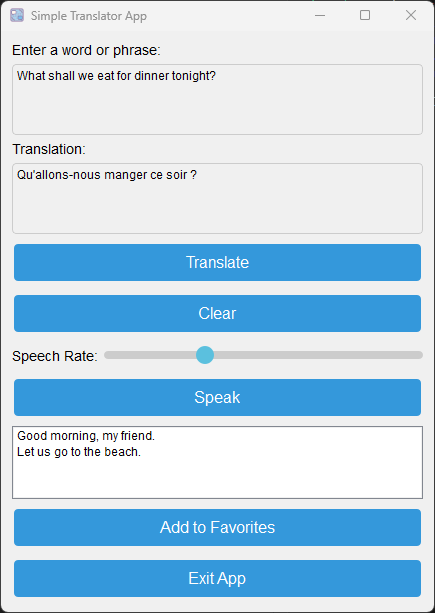

  # Simple Translator App 📝  
  Simple Python app to translate words and phrases.   No API key required.
  

  ## Imports ✨  
  In your virtual environment:

    pip install -r requirements.txt

  ## Get Started 🚀  
  
    python main.pyw
  
  ## Features ✨ 
 - Text to speech
 - Favorite phrases
 - Window size and position saved/used
 - Easily add more languages

 Default languages:
 - English (American)
 - French
 - Spanish
 - Italian
 - German
 - Russian

  

  ## Screen shots
  

  ##
  ## License: MIT