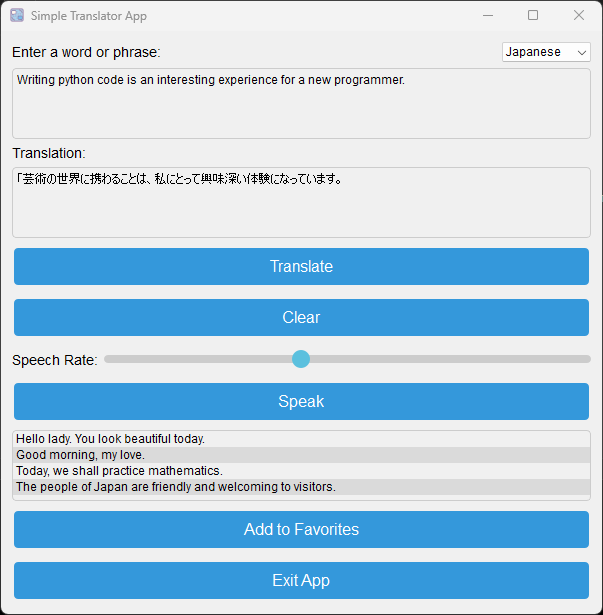

  # Simple Translator App 📝 
  Simple Python app to translate words and phrases.   No API key required.
  

  ## Imports ✨  
  In your virtual environment:

    pip install -r requirements.txt

  ## Get Started 🚀  
  
    python main.pyw
  
  Supports text to speech, favorites, as well as window size and position.
      

  

  ## Screen shots
  

  ##
  ## License: MIT